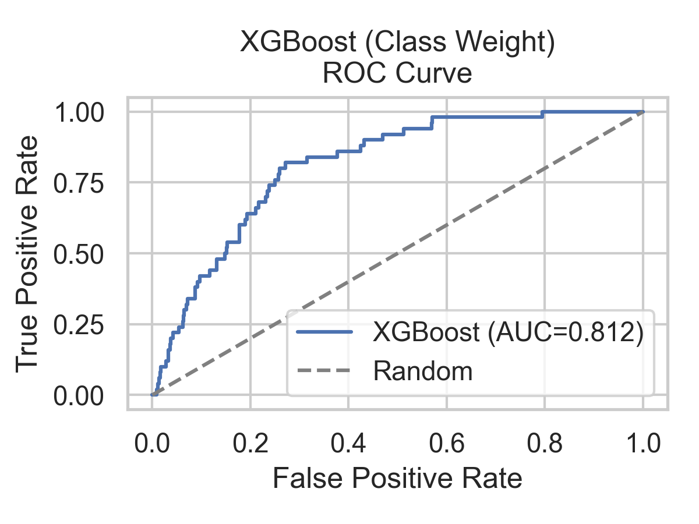

# Stroke Risk Prediction Using Machine Learning

A machine learning project focused on predicting stroke risk using healthcare and demographic data. The project explores multiple modelling strategies to address severe class imbalance while evaluating predictive performance using classification metrics and ROC-AUC analysis.

---

## Project Overview

This project analyzes a healthcare dataset containing 5,110 patient records with attributes including:

- Age
- BMI
- Hypertension
- Heart Disease
- Average Glucose Level
- Smoking Status
- Marital Status

The workflow included:

- Data preprocessing and cleaning
- Exploratory Data Analysis (EDA)
- Feature encoding
- Model training and evaluation
- Handling imbalanced classes using SMOTE and class weighting
- Comparative model performance analysis

---

## Tools & Technologies

- Python
- Pandas
- NumPy
- Scikit-learn
- XGBoost
- Matplotlib
- Seaborn
- RapidMiner

---

## Repository Structure

```text
stroke-risk-prediction-ml/
│
├── data/
├── figures/
├── rapidminer/
├── src/
│   ├── stroke_eda_final.py
│   ├── stroke_modeling_baseline.py
│   ├── stroke_modeling_smote.py
│   └── stroke_modeling_classweight.py
│
└── README.md
```

---

## Modelling Approaches

| Script | Strategy | Models |
|---|---|---|
| `stroke_modeling_baseline.py` | Baseline modelling | Logistic Regression, Random Forest, Naive Bayes |
| `stroke_modeling_smote.py` | SMOTE oversampling | Logistic Regression, Random Forest, Naive Bayes, XGBoost |
| `stroke_modeling_classweight.py` | Class weighting | Logistic Regression, Random Forest, Naive Bayes, XGBoost |

---

## Model Performance

| Model | Accuracy | ROC-AUC |
|---|---|---|
| Logistic Regression | 74% | 0.836 |
| Random Forest | 95% | 0.801 |
| XGBoost | 78% | 0.812 |
| Naive Bayes | 32% | 0.810 |

---

## ROC Curve

<p align="center">
  
</p>

---

## Key Insights

- Logistic Regression achieved the highest ROC-AUC score of 0.836.
- XGBoost demonstrated balanced predictive performance on imbalanced healthcare data.
- SMOTE and class weighting techniques improved minority class detection.
- Comparative evaluation highlighted the trade-offs between accuracy and recall in healthcare prediction systems.

---

## Dataset

Dataset sourced from Kaggle:

[Healthcare Stroke Prediction Dataset](https://www.kaggle.com/datasets/fedesoriano/stroke-prediction-dataset)

---

## Contributors

- Blen Agaze Nima
- Marilyn Igwe
- Swati Poojary
